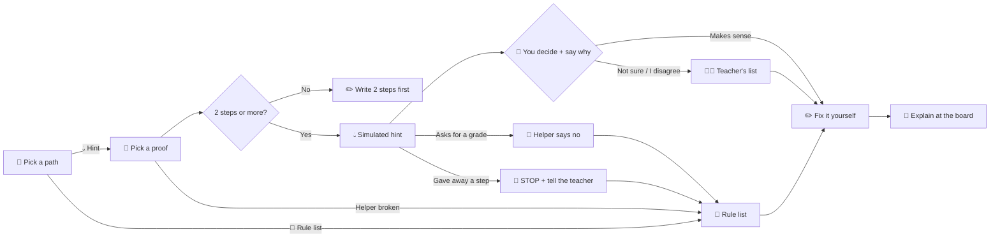

# 🧩 ARD: How the Pieces Fit

🧪 **Build pages:** [0 How it works](00%20How%20the%20Build%20Works.md) · [1 PRD](01%20PRD%20-%20What%20We%27re%20Making.md) · [2 ARD](02%20ARD%20-%20How%20the%20Pieces%20Fit.md) · [3 Checklist](03%20Prep%20Checklist.md) · [4 Handoff](04%20Build%20Handoff.md) · [5 Tests](05%20Tests%20and%20Decisions.md) · [6 Two ways](06%20Two%20Ways%20to%20Build%20It.md)

> [!NOTE]
> 📖 **ARD** = **Architecture Requirements Document**. It says how the parts connect, where data goes, and how the rules work.

## 1️⃣ The pieces
- 🖱️ **Design:** 1 web page. It runs on your computer.
- 🛠️ **Built with:** 1 HTML file and plain JavaScript. No installs. No accounts. No internet needed.
- ❓ **Why:** a teammate opens it with a double-click.
- 🧩 **The 5 parts:**
  1. 🖥️ **The screen:** the buttons and words.
  2. 📏 **The rule keeper:** stops bad requests. Locks Done. Sends unsure hints to the teacher.
  3. 💧 **The pretend helper:** hints that our team wrote first.
  4. 🧑‍🌾 **The teacher's list:** unsure hints go here.
  5. 🚪 **The exit:** the board talk, or the rule list.

## 2️⃣ The path

## 3️⃣ Where data goes
1. 📥 **In:** made-up proofs only. The Ask box is only for testing refusals.
2. 🖥️ **Runs:** only in your browser.
3. 🎭 **The AI:** **pretend.** Written first. Labeled on the screen.
4. 📤 **Leaves the computer:** **nothing that you type.** The page gets its fonts from Google Fonts. No answers go with that request.
5. 💾 **Saved:** **nothing.** We checked: browser storage is empty.
6. 🔑 **Keys:** none. A real AI needs a key. The key must stay on the server.
7. ❓ **Unknown:** with a real AI, we cannot be sure what the AI company keeps.

## 4️⃣ How the rules work
| # | Rule | How the build does it | Test | What it cannot promise |
|---|---|---|---|---|
| **1** | No grades | A word filter sends grade questions to "Helper says no". | Ask for an A | A tricky question can get past a filter. |
| **2** | A person decides | Done stays locked until there is a choice **and** a reason. | Try to skip | It cannot tell if the reason is honest. |
| **3** | No private info | Made-up proofs only. You cannot type your own proof. | Look at the screen | Someone can type private text in the Ask box. It is not saved or sent. |
| **4** | No-AI way | The rule list needs no helper. | Break the helper | Not tested with a screen reader. |
| **5** | Stop rule | "Gave away a step" stops the helper for that proof. | Press it. Try again. | **Start over clears the stop.** Fix it. |

> [!IMPORTANT]
> 📏 **A prompt alone is not a safety rule.** These rules are in the **code**.

## 5️⃣ Build order and undo
1. ✅ Rule list (no AI) and the screen
2. ✅ Practice proofs with labeled pretend hints
3. ✅ Decide step, refusals, broken mode, stop button, Start over
4. ✅ Our 16 checks · ⬜ another team's test
5. ⬜ Fix the Start over hole · ⬜ then think about a real AI

- 💾 **Last safe version:** git tag `checkpoint-before-m3-build`
- ↩️ **Undo:** `git checkout checkpoint-before-m3-build -- .`
- 👥 **Who explains each part:** `[fill in 1 teammate for each part]`
- ⏳ **Not built yet:** real AI · real teacher inbox · a stop that stays after Start over · screen-reader test
